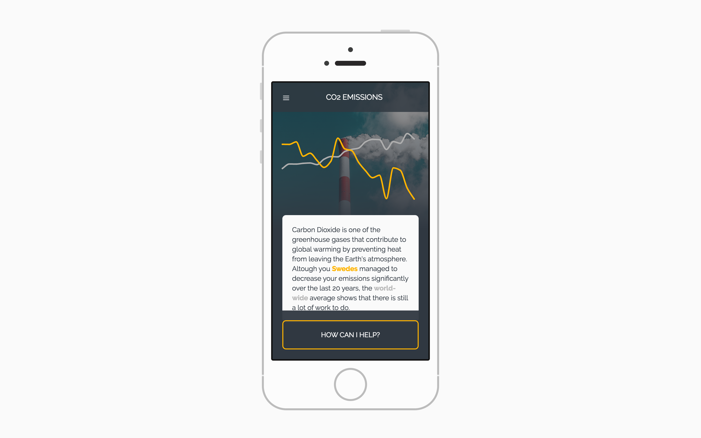

# ClimateQuest

ClimateQuest is a prototype that explores a playful approach of presenting data related to global warming. It presents you with a topic, gives you a related challenge and thereby demonstrates how everyone has the potential to make an impact. It was developed from scratch within two days during the course [Prototyping Interaction](https://www.umu.se/en/education/courses/prototyping-interaction) in the [Human Computer Interaction and Social Media](https://www.umu.se/en/education/master/masters-programme-in-human-computer-interaction-and-social-media/) Master's program at [Umeå University](http://www.umu.se/english). The goal of the assignment was to prototype ways of interacting with open data based on Paul Dourish's ideas on Embodied Interaction.

Together with a fellow student, we iterated on the project during our Master's thesis. This time, however, we took a different perspective and focused on how Embodied Interaction can inform and motivate action in the context of self-tracking. The thesis is published via [DiVa](http://urn.kb.se/resolve?urn=urn:nbn:se:umu:diva-136555).

You can access a live version of the prototype at:

- <http://andrsphil.github.io/climate-quest> (for mobile devices)
- <http://andrsphil.github.io/climate-quest/frame.html> (for Desktops)

## Browser Compatibility

The prototype was developed for and tested on the latest version of Google Chrome for Mac (55.0 at the point of writing) and Safari for iOS 10. Although it should work on other modern Browsers as well, you might experience some glitches.

## Thanks to ...

- [Samuel Scrimshaw (Landing page background)](https://unsplash.com/photos/2oFdVd00xOg)
- [veeterzy (Introduction header background)](https://unsplash.com/photos/UwBrS-qRMHo)
- [Redd Angelo (Challenge header background)](https://unsplash.com/photos/HsdiMBETJuY)
